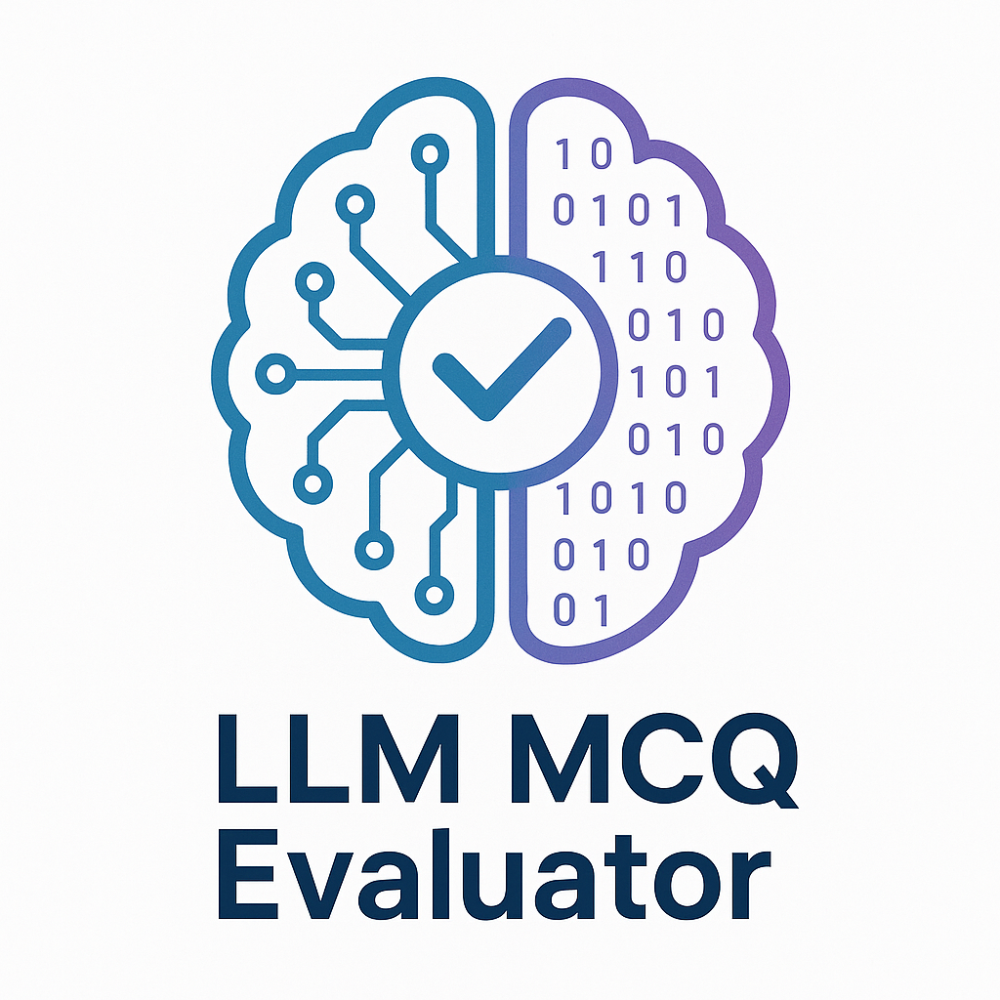

# 🚀 **LLM MCQ Evaluator** - *Test Your LLMs with MCQ questions!* 🧠💡  



**A powerful Python module to evaluate Large Language Models (LLMs) using your own custom multiple-choice questions (MCQs).**  

🔹 **Benchmark AI models** with ease  
🔹 **Track accuracy & reasoning** in real-time  
🔹 **Beautiful terminal UI** with progress tracking  
🔹 **Switch LLM providers** in seconds  

---

## 🛠 **Installation in 2 Simple Steps!**  

### **1️⃣ Clone & Install**  
```bash
git clone https://github.com/cyberytti/llm-mcq-evaluator.git
cd llm-mcq-evaluator  
```  

### **2️⃣ Run & Evaluate!**  
```bash
uv run main.py  
```  

**That’s it!** Your LLM evaluation starts instantly. 🎉  

---

## 🎯 **Why Use This Tool?**  

✅ **Test any LLM** (Ollama, OpenAI, Anthropic, etc.)  
✅ **Custom MCQ questions** (Math, Science, Coding, etc.)  
✅ **Rich Terminal UI** with progress bars & live accuracy  
✅ **Detailed logs** for deep analysis  

**Perfect for:**  
- Educators & students 📚  
- Developers testing LLMs 💻  

---

## 🚀 **Usage - Super Simple!**  

### **1️⃣ Define Your MCQs** *(in `main.py`)*  
```python
from test_script import MCQEvaluator  

questions = [  
    "What is 2+2? (A) 3 (B) 4 (C) 5 (D) 6",  
    "Which of the following is a programming language? (A) Python (B) HTML (C) JSON (D) CSV"  
]  

answers = ["b", "a"]  # Correct options

# Run the test!  
evaluator = MCQEvaluator(model_name="deepseek-r1:8b-llama-distill-q8_0")

# Run evaluation with 30-second timeout per question 
evaluator.run_test(questions, answers, time_limit=30)  
```  

### **2️⃣ See Instant Results!**  
📊 **Live accuracy tracking**  
✅ **Correct/Incorrect verdicts**  
📝 **Full logs in `/logs` folder**  

---

## 🔄 **Switch LLM Providers in Seconds!**  

Just **modify 2 lines** in `test_script.py`:  
```python
from agno.models.ollama import Ollama  # 🔄 Replace with your provider  
...  
model=Ollama(id=self.model_name),  # 🔄 Update model initialization  
```  

**Supports:**  
- Ollama 🦙  
- OpenAI 🤖  
- Anthropic 🧠  
- Hugging Face 🤗  
- And more!  

---

## 📹 **Watch It in Action!**

---

## 💡 **Who Is This For?**  

✔ **AI Engineers** – Benchmark LLM performance  
✔ **Researchers** – Compare model reasoning  
✔ **Educators** – Test AI knowledge  
✔ **Students** – Learn how we can benchmark LLMs

---

## 📜 **License**  

MIT License - **Free to use & modify!**  

---

## 🔥 **Ready to Test Your LLM?**  

🚀 **Clone the repo & start evaluating today!**  

```bash
git clone https://github.com/cyberytti/llm-mcq-evaluator.git
```  

**Happy Testing!** 🎯🤖
